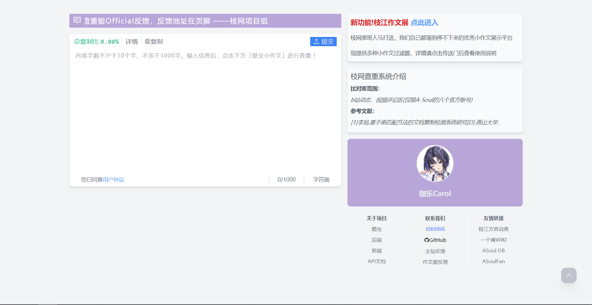

# AsoulCnkiFrontEndV3



[枝网查重](https://asoulcnki.asia)的前端


## 迁移描述

1. [x] 从 Vue2 迁移到 Vue3 + TS
2. [x] 打包工具更换为 Vite
3. [x] 使用 WindiCSS 重构样式
4. [x] 重新调整部分样式，重点是夜间模式配色

## 如何贡献

先 fork 项目到您的 GitHub 账户，然后再 clone，开新分支并发起 PR

## TODO

### Check 页

基本迁移完成，目前移除了 Result，改为一键清空文本框

#### 新特性

1. 一键清除文本框

#### 待实装新特性

1. 支持查看自己的查询历史，并可以清空(使用 localStorage)

#### 其他

只需要在 ElDialog 的标签上添加 `width="none"` 就可以禁用 Element-Plus 默认添加的 width

### Rank 页

1. 页面基本重构完成
2. 添加页码切换功能

#### 新特性

1. 页码切换悬浮屏幕右侧
2. 使用方向键 `←` `→` 翻页

## 其他

1. [x] Element 局部引入

   备忘: 目前使用的组件

   - ElCheckBox
   - ElDialog
   - ElCarousel
   - ElCarouselItem

2. [x] 接口文档参见[这里](https://github.com/ASoulCnki/.github/tree/master/api)

3. [x] 新增 PWA 适配

## 项目结构

```
src 源码目录
├── api          调用后端API，使用await
│   ├── check    查重API
│   └── rank     作文展API
├── assets       资源文件
│   ├── css      样式和字体文件
│   └── images   图片文件
├── components   组件
│   ├── check    主站(查重)组件
│   ├── public   公共组件(小作文组件，友情链接，顶部通知栏，侧边栏跑马灯，用户协议)
│   └── rank     作文展组件
├── hooks
├── libs         库文件夹，目前只有 Element-Plus
├── pages        页面文件夹(Check, Rank)
├── router       前端路由(目前未根据组件拆分)
└── utils        工具函数(时间格式转换等)
    ├── article  小作文组件的支持函数(重复区间标记, 文本链接转换）
    ├── check    check页支持函数(数据格式转换, 判别是否为字符画)
    ├── rank     rank页支持函数(待添加过滤器相关方法)
    └── storage  封装localStorage属性
```

utils 部分功能待添加单元测试？

## 安装

```bash
npm i
```

## 运行 && 打包

### 启动开发机

```bash
npm run dev
```

### 构建

```bash
npm run build
```

### 本地预览构建产物

```bash
npm run serve
```
